# 🛒 Retail Sales Intelligence
## Stakeholder-Driven Sales & Customer Analytics with SQL Server & Excel

---
## 📖 Executive Summary

Modern retail organizations generate enormous volumes of transactional data across customers, products, stores, and sales channels. While this data holds significant strategic value, it often remains underutilized without structured analysis.

This project explores a global retail dataset using **SQL Server** and **Microsoft Excel** to uncover meaningful business insights that support strategic decision-making. The analysis focuses on understanding customer purchasing behaviour, sales trends, product performance, profitability, and geographic sales distribution.

The findings provide actionable recommendations that can help retail executives optimize inventory planning, improve customer retention, increase profitability, and identify opportunities for market expansion.

---

## 🎯 Business Objective

The objective of this project is to transform raw retail transaction data into meaningful business intelligence by answering key stakeholder questions using SQL and Excel.

Specifically, the analysis aims to:

- Identify historical sales trends and seasonal demand patterns.
- Evaluate product and category performance.
- Discover customer purchasing behaviours and loyalty patterns.
- Assess geographical sales performance.
- Provide actionable recommendations for improving business performance.

---

## 📂 Dataset Overview

**Source**

- Maven Analytics

The original dataset contained all business processes in a single denormalized table.

To improve analytical accuracy and database performance, the dataset was transformed into a **Snowflake Schema**, eliminating duplicate records and separating transactional data from descriptive attributes.

This restructuring significantly improved:

- Query performance
- Data integrity
- Scalability
- Analytical accuracy
- Report reliability

---

## 🏗️ Dimensioned Tables

### 👥 Customers

This table contains all information related to customers such as:

- CustomerID
- Name
- Gender
- Date of Birth
- City
- State
- Country

**Relationship:** Connects to the **Orders** table using the **CustomerID** column.

---

### 📦 Orders

This table contains information at the order level such as:

- OrderNumber
- Order Date
- Delivery Date
- CustomerID
- StoreID

**Relationship:** Filters the **Transactions Fact** table using the **OrderNumber** column.

---

### 🧾 Transactions Fact

This table contains atomic transaction records at the lowest level.

Attributes include:

- TransactionID
- OrderNumber
- LineItem
- Quantity
- ProductID

---

### 🏬 Stores

Contains information about all the stores and their locations where customers placed orders and had them shipped.

**Relationship:** Relates to the **Orders** table using the **StoreID**.

---

### 🛍️ Product

This table contains all information about products on sale.

Attributes include:

- ProductID
- ProductName
- ProductBrand
- ProductColor
- ProductCost
- ProductPrice
- ProductSubCategoryID

**Relationship:** Filters the **Transactions Fact** table using the **ProductID** column.

## 📌 Next Section

The following sections explore the business questions answered throughout this analysis, including:

- 📈 Sales Trend Analysis
- 🛍 Product Performance
- 🏬Store Performances
- 🌍 Geographic Analysis
- 👥 Customer Insights
- 💡 Key Findings
- 🚀 Strategic Recommendations

----

## 1. 📈 Seasonality & Trend Analysis

**1a. What were the seasonal sales trends over the past three business years, and how did they vary across seasons?**

*Figure 1: Monthly order trends across the three business years*

### 💡 Key Insight

- **2019 recorded the highest order volumes** across most months, particularly during the second half of the year, making it the strongest-performing year in the analysis period. This suggests that favorable business strategies or market conditions positively influenced sales performance.

- **Sales in 2020 trailed both 2018 and 2019** across most months, with a noticeable decline in the latter part of the year. This trend may reflect the impact of global economic disruptions, including the COVID-19 pandemic, on consumer spending and supply chain operations.

- **Monthly demand followed a consistent seasonal pattern** across all three years. Sales began strongly in **January and February**, indicating robust customer demand at the start of each year.

- A **significant decline in order volumes** was observed between **March and May** across all years. This recurring trend may be attributed to seasonal fluctuations, reduced consumer demand, or other external business factors.

- **Sales activity rebounded considerably between October and December**, particularly in **2019**, suggesting a strong correlation with holiday shopping and year-end promotional campaigns.

**1b. How did order volumes fluctuate across the four seasons of the year?**

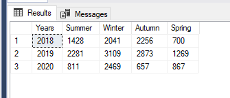

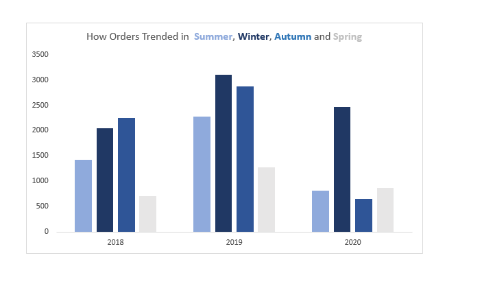

In 2018, Winter and Autumn emerged as the dominant seasons for orders, collectively driving the highest order volumes for the year. 

By 2019, which stands out as the most successful business year among the three, Winter and Autumn persist and maintained their position as the leading seasons, with Summer following closely in third place. 

In 2020, Winter once again outperformed all other seasons, solidifying its status as the peak period for sales. Across the three years, Winter consistently proved to be the most high-demand season, while Autumn also showed strong performance in 2018 and 2019, reinforcing its significance as a critical sales period.

**1c. Which days of the week consistently account for the highest demand and sales?**

![Orders trends per day of the week[2018-200]](asset/Orders_by_Day_of_the_week_sql.png)

![Orders trends per day of the week[2018-200]](asset/Orders_by_Day_of_the_week_Charts.png)

The chart reveals a consistent rise in order volumes throughout the week across 2018, 2019, and 2020. Sundays consistently record the lowest order volumes, while order numbers steadily increase, peaking on Saturdays. However, the highest demand days across the three years are Wednesdays, Thursdays, and Fridays, demonstrating consistent midweek and weekend activity.

---

## 2. 🛒 Product Performances 

**2a. Which product subcategories contribute the most to overall revenue?**

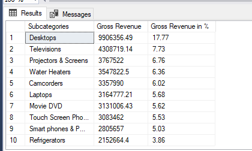

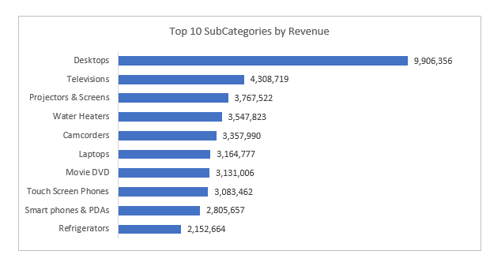
*Figure 2a: Top revenue driving subcategories*

The leading revenue-generating subcategory is Desktop Computers within the Computer category, contributing 17.77% of total revenue. This is closely followed by Televisions, Projectors/Screens, Water Heaters, and Camcorders, which collectively generate over $4.3 million, $3.7 million, $3.5 million, and $3.3 million, respectively. Completing the top 10 are Laptops ($3.16 million), Movie DVDs ($3.13 million), Touch Screen Phones ($3.08 million), Smartphones/PDAs ($2.80 million), and Refrigerators ($2.15 million).

**2b. Which product categories are most effective at driving repeat purchases?**

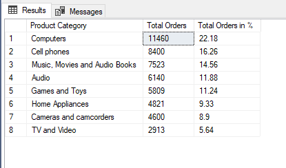

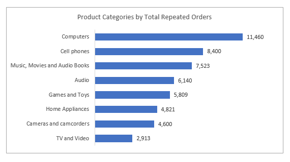
*Figure 2b: Product categories driving repeated purchases*

The computers category contributes most to repeated orders with a total of 11,460, accounting for 22.18% of all repeated purchases across categories. Following this, Cell Phones secure second place with 8,400 repeated orders, contributing 16.26% to the total. Music, Movies, and Audio Books rank third, with 7,523 repeated orders, making up 14.56%. The Audio category follows closely with 6,140 repeated orders (11.88%), while Games and Toys round out the top five, contributing 5,809 repeated orders (11.24%). These insights highlight the most customer-loyal categories, providing opportunities to further enhance customer retention strategies.

#### 2c. Which products are the most profitable based on the difference between product cost and product price?

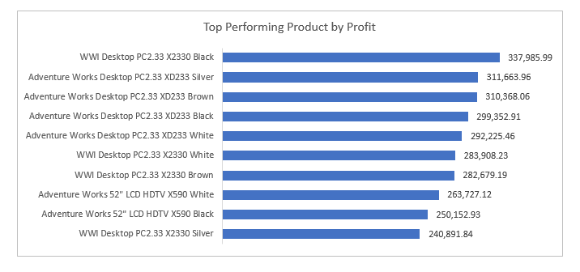

The top-performing products by profit are distinguished by narrow profit margins, with WWI Desktop PC2.33 X2330 Black leading the category, generating $337,985.99 in profit, accounting for approximately 1.03% of total profits. Following closely are Adventure Works Desktop PC2.33 XD233 Silver with a profit contribution of 0.95% and Adventure Works Desktop PC2.33 XD233 Brown at 0.95%. Other notable entries include Adventure Works Desktop PC2.33 XD233 Black (0.92%), Adventure Works Desktop PC2.33 XD233 White (0.89%), and WWI Desktop PC2.33 X2330 White (0.87%), completing the top six.

## 3. 🏪 Store Performance 

#### How did different store locations perform in terms of sales volume and revenue?

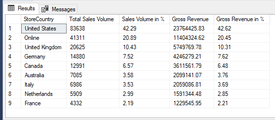

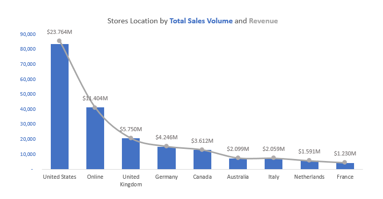

The chart highlights the correlation between sales volume and revenue generated across various store locations. The United States leads both metrics with a total sales volume of 83,638 and gross revenue of $23.764M, contributing a dominant 42.62% of total revenue. The Online channel follows, with a sales volume of 41,311 (20.89%) and revenue of $11.404M (20.45%). The United Kingdom, Germany, and Canada round out the top five, with sales volumes of 20,625 (10.43%), 14,880 (7.51%), and 12,991 (6.57%), and revenues of $5.750M (10.31%), $4.246M (7.62%), and $3.612M (6.48%), respectively.

----

## 4. 👥 Customer Insights

#### 4a.  Who are the top customers by total spending, and what is their demographic profile (age, gender, location)?

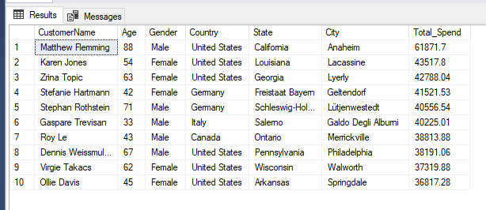

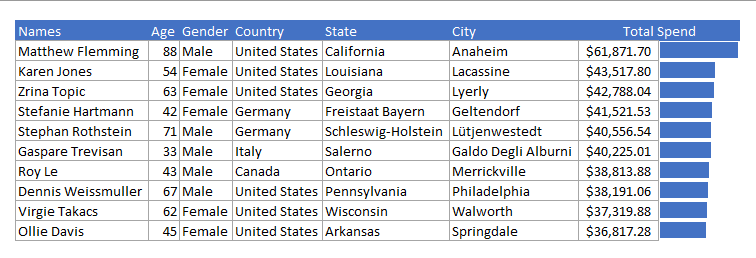

Matthew Flemming, aged 88, stands out as the top spender with a total expenditure of $61,871.70, far exceeding the other high-spending customers. Karen Jones follows with $43,517.80, and Zrina Topic is third with $42,788.04. Other significant contributors include Stefanie Hartmann ($41,521.53), Stephan Rothstein ($40,556.54), and Gaspare Trevisan ($40,225.54), making up the top six customers in terms of total spending. These individuals represent a significant portion of revenue and merit focused engagement.

#### 4b. Who are the top customers by Most Orders or repeated patronage, and what is their demographic profile (age, gender, location)?

Gaspare Trevisan, aged 33, emerges as the top customer by repeated patronage, recording a remarkable 14 repeated orders. He is followed by Delmer Martinez, aged 74, with 12 repeated orders, demonstrating strong loyalty despite his senior age. Katherine Rosales, aged 38, ranks third with 11 repeated orders, showcasing consistent engagement with the brand.

Other notable contributors include René Fuerst, aged 64, and Jens Himmel, aged 61, both from Germany, along with Uriele Marcelo, aged 59, from Italy, each recording 10 repeated orders. Elizabeth Butler, aged 25, from the United Kingdom, and Edward Rose, aged 46, also from the United Kingdom, further highlight the global distribution of loyal customers, each contributing 10 repeated orders.

#### 4c. What’s the average Order value by age Category or groups.

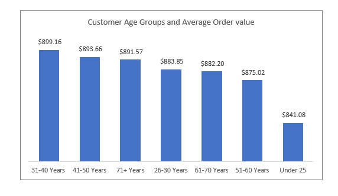

There is not a wide or significant difference in average order value across the age groups. Albeit Customers aged 31–40 years lead with the highest average order value ($899.16), followed closely by those aged 41–50 years ($893.66) and 71+ years ($891.57). Other age groups show minor differences, with those under 25 having the lowest value ($841.08).

--------

## 5. 🌍 Geographic Analysis

#### 5a. Which Countries contributed most in sales?

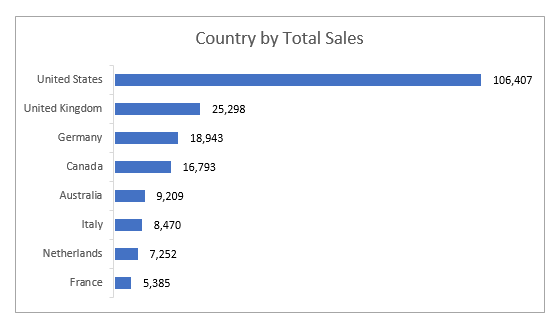

The United States dominates sales with over half the total volume (106,407), followed by the United Kingdom (25,298) and Germany (18,943). Other key markets include Canada (16,793) and Australia (9,209). Italy, the Netherlands, and France contribute moderately with 8,470, 7,252, and 5,385, respectively.

#### 5b. Which Countries generated the highest revenue?

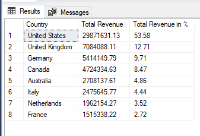

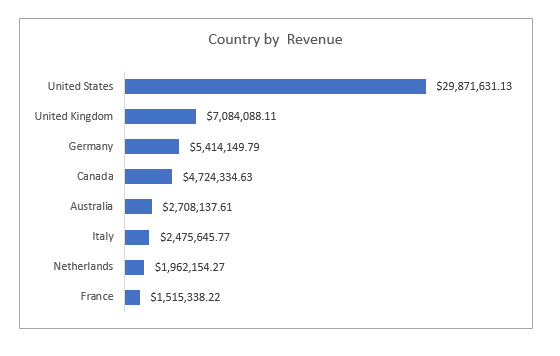

The United States leads in revenue generation with $29,871,631.31 (53.58% of total revenue). The United Kingdom follows at $7,084,088 (12.71%), with Germany in third, contributing $5,414,149.79 (9.71%). Canada rounds out the top four with $4,724,334.63 (8.47%).

----
## 🚀 Strategic Recommendations

### 📈 Seasonality Trends

-   Perform a deeper analysis to investigate and understand the causes of the sales drop during this period March–May Decline and also Leverage Late-Year Performance as seen in October–December and amplify year-end marketing efforts with discounts, promotional campaigns, incentives to capitalize on holiday-driven demand.

-   Analyze the strategies that contributed to 2019’s success. Replicate effective campaigns, pricing strategies, or operational efficiencies to improve future performance.

-   Focus on Winter Campaigns: With Winter consistently leading in order volumes, prioritize marketing efforts, promotions, and inventory planning during this season.

-   Inventory Management/Operational Optimization: Ensure sufficient stock levels to meet increased demand during peak days and allocate adequate staff and system resources to handle the higher order volumes efficiently on high-demand days.

### 🌎 Geographic Distributions
-   Maximize U.S. Market Potential: The U.S represent the most active and vibrant markets so a recommended call to action is for the global retailing agency to leverage the United States’ strong sales performance by introducing loyalty programs, targeted promotions, and expanding product offerings.

-   Consolidate Online Sales Experience: Leverage online channel’s significant contribution by optimizing website performance and also offering competitive shipping options.

-   Expand Presence in Emerging Markets: Focus on increasing sales in promising regions like Canada and Germany by tailoring products to local preferences and enhancing marketing campaigns and analyze Low-Performing Locations to identify challenges and implement corrective strategies.

### 🫂 Customers Performance.
-   Tailor communication and services to notable high-value customers to strengthen loyalty by regularly checking in on their satisfaction levels and send personalized thank-you notes or gifts as a gesture of appreciation for their loyalty.

-   Introduce tier-based loyalty programs offering rewards such as free delivery, early access to new products, or priority support to handle their inquiries or complaints.

-   Analyze purchasing patterns of these top customers to identify opportunities for cross-selling or upselling and use predictive analytics to anticipate their needs and offer proactive recommendations.

-   Target marketing efforts and promotions at customers aged 31–50 years and 71+ years, as they demonstrate the highest spending potential. Offer personalized incentives to younger customers (under 25) to encourage higher spending.

### 🛒 Products Performance.
-   Boost Availability and Marketing of Top Performing products: Prioritize inventory and promotions for the top profit-generating products to capitalize on their strong market demand.

-   Strategic Focus on top Categories and Subcategories: Prioritize marketing and promotional efforts for the top revenue-generating subcategories, particularly Desktops and Televisions, to sustain and enhance their performance.

-   Bundle Offers and Cross-Selling: Develop bundle deals (e.g., laptops with accessories) and cross-sell related products to maximize revenue from high-demand categories.

-   Inventory and Stock Management: Ensure optimal inventory levels for the top-performing subcategories to meet customer demand seamlessly.

## Conclusion

The primary objective of this analysis was to address key business questions raised by stakeholders, providing them with valuable insights into historical trends and the current state of the business. This comprehensive analysis touched on various dimensions of the global retail company’s operations, revealing critical insights into orders over time, top-performing products, high-demand regions, and key customer segments. In line with the discoveries from the data, actionable recommendations have been proposed to empower stakeholders with strategies to streamline operations, enhance customer satisfaction and loyalty, drive revenue growth, and expand market reach. These insights serve as a foundation for informed decision-making and sustained business success.

# 🛠 Tech Stack

| Technology | Purpose |
|------------|---------|
| SQL Server | Data Extraction & Analysis |
| Microsoft Excel | Data Exploration & Visualization |
| T-SQL | Business Query Development |
| Snowflake Schema | Database Design |
| GitHub | Portfolio Documentation |